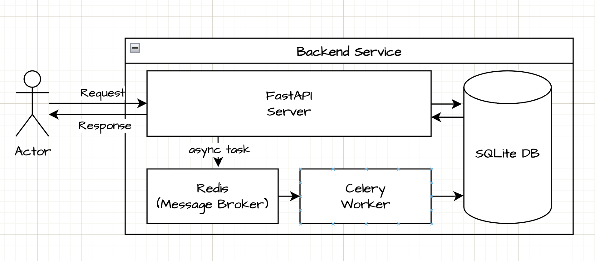
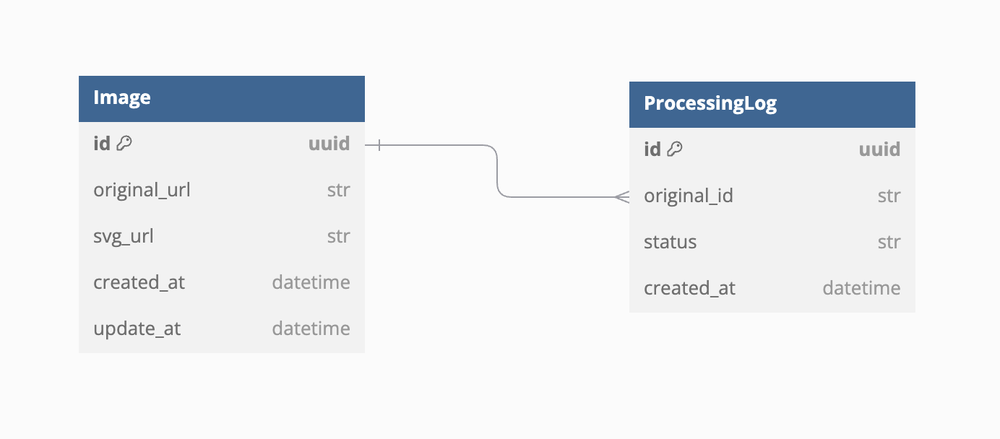

# simple-image-upload-api
jpg, png 이미지를 저장하고, 변환하는 api 서버

## 시스템 아키텍쳐


## ERD



## 디렉토리 구조
```

├── app/
│   ├── main.py                                 # fastapi start 지점
│   ├── api/                                    # controller 정의
│   │   ├── depedencies.py                      # controller 실행 시, 의존성 주입
│   │   └── v1/
│   ├── model/                                  # db 모델 정의
│   ├── repository/                             # db 모델을 이용한, repository 구현체
│   ├── service/                                # 어플리케이션 서비스
│   ├── schema/                                 # pydantic을 이용한 데이터 스키마
│   │   ├── dao/                                 
│   │   ├── dto/                                
│   │   └── enum/                               
│   ├── tasks/                                  # celery task
│   │── util/                                   # 서비스 유틸 (helper)
│   ├── config/                                 # 설정파일 (env, db)
│   ├── exception/                              # 예외
│   └── tests/                                  # 테스트 (app 하위 구조를 그대로 따르고 있음)                            
│       ├── conftest.py                         # 공통 fixtures
│       ├── helper.py                           # 테스트 헬퍼
│       ├── api/    
│       ├── repository/
│       ├── service/
│       └── util/
├── volume/                                     # database 저장위치      
├── poetry.lock                                 # 의존성 관리 트리
├── pyproject.toml                              # 의존성 및 프로젝트 관리를 위한 정보 
├── Dockerfile                                  
├── docker-compose.yml     
└── Makefile                                    # 프로젝트 실행 스크립트 모음

```

## 프로젝트 실행 방법
Makefile에 정의된 실행 명령어를 이용해 프로젝트를 실행합니다.
```bash
make build

make run
```

## 아쉬웠던 점
### 1. 이미지 처리
- 윤곽을 100% 완벽하게 가져오지는 못하는것 같음. 희미한 윤곽은 제거 처리하는데 원인을 발견하지 못하고 마무리한게 아쉬웠음.
- 색상정보를 완벽하게 가져오지 못해, 결국 Grayscale한 이미지를 svg로 변환하는 식으로 처리하였음.
- 이미지 처리가 생각보다 오래걸리는 것을 알았고, celery를 도입계기가 되었음.

### 2. 디렉토리 구조
- 이미지 도메인 하나인데도 불구하고, 디렉토리들이 너무 세세하게 쪼개져 있음.
- Fastapi 공식 홈페이지에 가면 [디렉토리 Best practice](https://github.com/zhanymkanov/fastapi-best-practices?tab=readme-ov-file#project-structure)가 있는데, 이런식으로 도메인별로 디렉토리를 만들고, 하위에 파일들을 만드는게 확장에 있어서 더 나을 것 이라고 생각이 들었음.

